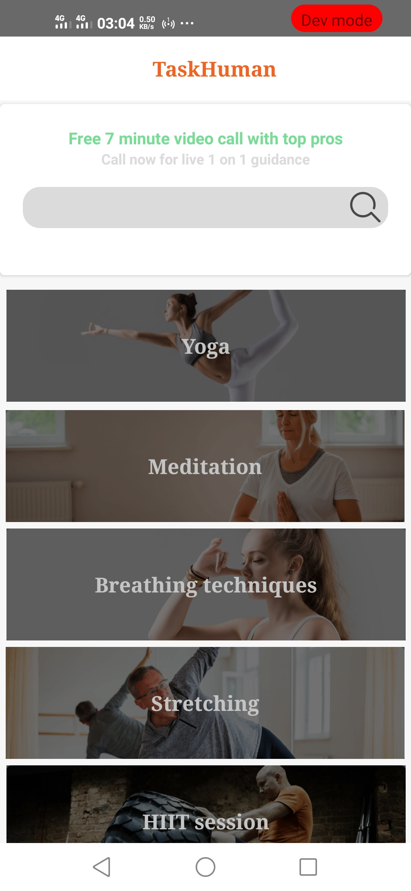
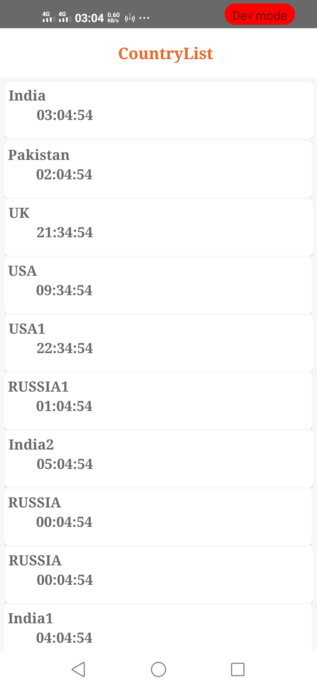

# MoreYeah-Sample
Sameple application that follows the clean architecture.

**The goal of this app is to show how to implement MVVM design pattern with architecture components & clean architecture in Kotlin .**

##  Source Code representation :
The repository has two branches

1-master : It has the implementaion of latest technologies such as kotlin coroutines, LiveData and repository pattern and Its the newest & latest version of the updated code .

- data : Contains data layer which has local & remote data sources with repository implementation.
- domain : Contains the domain layer and useCases with repository interfaces.
- presentation : Contains the view layer that consists of views & viewModels

**Please note that each developer has his own style in coding ,The goal is to implement the concepts of the design and architecting in the right way .**

### Contribution

Please feel free to make a pull request or fork.

### Rate

If you find this repository useful please give it a star .
